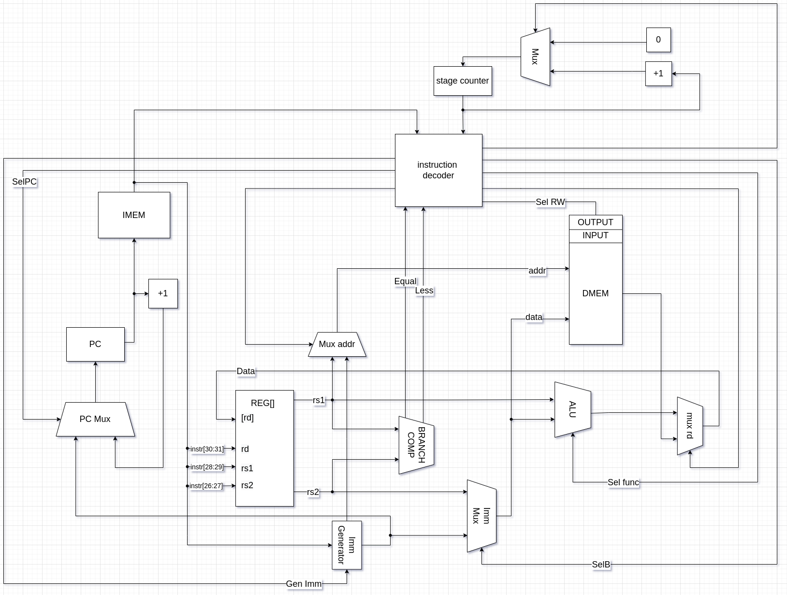

# CSA lab 3
Выполнил Горинов Даниил Андреевич P33151
### Вариант ###

- `alg | risc | harv | hw | instr | binary | stream | mem | pstr | prob5 | pipeline`
- Без усложнения

## Язык программирования

```bnf
<program>         ::= statement | program statement
<statement>       ::= control_flow | io | allocation | assign | read | write
<assign>          ::= name "=" expr | name "[" digit "]" = expr
<io>              ::= "gets" letter | "gets" string | "puts" string | "put" name
<allocation>      ::= "val" name "=" value ";" | "val" name;" | "val" name "[" digit "]"
<control_flow>    ::= conditional | conditional else
<conditional>     ::= while | if
<if>              ::= "if(" comp_expr ")" block
<else>            ::= "else" block
<while>           ::= "while(" comp_expr ")" block
<block>           ::= "{" program "}"
<comp_expr>       ::= "(" expr comparison_sign expr ")" | "(" name ")" | "(" value ")"
<value>           ::= string | digit
<string>          ::= "\"[\w\s,.:;!?()\\-]+\""
<expr>            ::= "(" expr ")" | digit | letter | string
<string>          ::= "\"[\w\s,.:;!?()\\-]+\""
<comparison_sign> ::= "==" | ">=" | ">" | "<" | "<=" | "!="
<letter>          ::= "[a-zA-Z]+"
<digit>           ::= "[0-9]+"
<op>              ::= "*" | "/" | "%" | "+" | "-" | "<<" | ">>" | "&" | "|" | "^"
```

Разработанный язык похож на что-то вроде JavaScript без явной типизации.

Строки разделяются точкой с запятой. Язык поддерживает объявление и инициализацию переменных, математические операции, простейшие списки, конструкции if, if-else, while, while-else, операции чтения и записи (get, gets, put, puts).

Язык поддерживает области видимости, которые определяются блоками while и if.

Пример:

```
val r = 1;
val i = 2;
val k;
val a;

while (i <= 20) {
    if (r % i) {
        k = i;
        a = k * i;
        while (a <= 20) {
            k = i * k;
            a = k * i;
        }
        r = k * r;
    }
    i = i + 1;
}
```

### Организация памяти

Работа с памятью

Модель памяти процессора:

По варианту использутется гарвардская архитектура, поэтому память инструкций и память данных разделена.
- Память данных. Машинное слово -- 32 бита, знаковое. Линейное адресное пространство. Реализуется списком чисел, являющихся пространством памяти.
- Память команд. Машинное слово -- 32 бита. Реализуется списком сисел, описывающих инструкции.

```text
i - number of instructions
     Memory
     Instruction memory
+-----------------------------+
| 00  : instruct 1            |
| 01  : instruct 2            |
| 02  : instruct 3            |
|    ...                      |
| i   : halt                  |
+-----------------------------+

  Data memory
+------------------------------+
| 00  : variable 1             |
| 01  : variable 2             |
| 02  : array variable 1,len=l |
|    ...                       |
| l+2 : variable 3             |
| l+3 : variable 4             |
|    ...                       |
|                              |
+------------------------------+
|           INTPUT             |
+------------------------------+
|           OUTPUT             |
+------------------------------+

```

- Little-Endian
- В языке отсутствует константы, поэтому здесь не будут описаны
- Статические данные последовательно загружаются в память, динамические же хранятся в стеке. Стек, идет с конца data memory
- Адрес возврата перед вызовом функции кладется на стек
- Булевые значения где true - 1 , а false - 0
- Строковые буфферы также статически выделяются в памяти данных при компиляции, изначально заполнены нулями, при их встрече используется адрес начала буффера.
- Строки сохраняются в памяти данных последовательно по мере обнаружения их в программе транслятором. Один символ - одна ячейка памяти
- Для того чтобы загружать значения непосредственно в DataPath существует функциональный элемент - Immediately Generator.
- Литералы не хранятся в статистический памяти
- Как будут размещены литералы, сохранённые в статическую память, друг относительно друга? - Последовательно друг за другом, выравнивания нет.
- Как будет размещаться в память литерал, требующий для хранения несколько машинных слов? - Такими литералами являются строки. Они хранятся в памяти байт за байтом.
- В каких случаях переменная будет отображена на регистр или на статическую память? - Все переменные отображаются в статически аллоцируемую область памяти на этапе компиляции/трансляции.

## Система команд Процессора

Особенности процессора:

- Машинное слово - 32 бита
- 4 регистра
- размер команд и типы аргументов фиксированы, имеет 4 типа
  - Register
  - Immediate
  - Branch
  - Jump
- каждая инструкция выполняется за 5 этапов (по такту на каждый)
  - `fetch_instruction` - загрузка инструкции из памяти данных
  - `decode_instruction` - декодирование инструкций
  - `execute` - выполнение инструкций (вычисления в АЛУ, вычисления флагов по результату сравнения в branch comparator)
  - `memory_access` - доступ к памяти - для инструкций
  - `write_back` - запись результирующего значения (из памяти или АЛУ в регистр). На этом же этапе в инструкциях переходов переписывается значение pc'a

### Набор инструкций

| Инструкция | Номер | операнды          | Тип         | Пояснение              |
|:-----------|-------|:------------------|:------------|------------------------|
| HALT       | 0     | 0                 | Instruction | Останов                |
| LW         | 1     | 2 (reg, reg)      | Register    | dmem [rs2] -> rd       |
| SW         | 2     | 2 (reg, reg)      | Register    | rs1 -> dmem [rs2]      |
| LWI        | 3     | 2 (reg, imm)      | Immediate   | dmem [imm] -> rd       |
| SWI        | 4     | 2 (reg, imm)      | Immediate   | rs1 -> dmem [imm]      |
| JMP        | 5     | 1 (imm)           | Jump        | PC - imm -> PC         |
| BEQ        | 6     | 3 (rs1, rs2, imm) | Branch      | rs1 == rs2 ? imm -> pc |
| BNE        | 7     | 3 (rs1, rs2, imm) | Branch      | rs1 != rs2 ? imm -> pc |
| BLT        | 8     | 3 (rs1, rs2, imm) | Branch      | rs1 < rs2 ? imm -> pc  |
| BGT        | 9     | 3 (rs1, rs2, imm) | Branch      | rs1 > rs2 ? imm -> pc  |
| BNL        | 10    | 3 (rs1, rs2, imm) | Branch      | rs1 >= rs2 ? imm -> pc |
| BNG        | 11    | 3 (rs1, rs2, imm) | Branch      | rs1 <= rs2 ? imm -> pc |
| SEQ        | 12    | 3 (reg, reg, reg) | Register    | rs1 == rs2 -> rd       |
| SNE        | 13    | 3 (reg, reg, reg) | Register    | rs1 != rs2 -> rd       |
| SGT        | 14    | 3 (reg, reg, reg) | Register    | rs1 > rs2 -> rd        |
| SLT        | 15    | 3 (reg, reg, reg) | Register    | rs1 < rs2 -> rd        |
| SNL        | 16    | 3 (reg, reg, reg) | Register    | rs1 >= rs2 -> rd       |
| SNG        | 17    | 3 (reg, reg, reg) | Register    | rs1 <= rs2 -> rd       |
| AND        | 18    | 3 (reg, reg, reg) | Register    | rs1 & rs2 -> rd        |
| OR         | 19    | 3 (reg, reg, reg) | Register    | rs1 \| rs2 -> rd       |
| ADD        | 20    | 3 (reg, reg, reg) | Register    | rs1 + rs2 -> rd        |
| SUB        | 21    | 3 (reg, reg, reg) | Register    | rs1 - rs2 -> rd        |
| MUL        | 22    | 3 (reg, reg, reg) | Register    | rs1 * rs2 -> rd        |
| DIV        | 23    | 3 (reg, reg, reg) | Register    | rs1 / rs2 -> rd        |
| REM        | 24    | 3 (reg, reg, reg) | Register    | rs1 % rs2 -> rd        |
| ADDI       | 25    | 3 (reg, reg, imm) | Immediate   | rs1 + imm -> rd        |
| MULI       | 26    | 3 (reg, reg, imm) | Immediate   | rs1 + imm -> rd        |
| SUBI       | 27    | 3 (reg, reg, imm) | Immediate   | rs1 + imm -> rd        |
| DIVI       | 28    | 3 (reg, reg, imm) | Immediate   | rs1 + imm -> rd        |
| REMI       | 29    | 3 (reg, reg, imm) | Immediate   | rs1 + imm -> rd        |


### Регистры

Процессор в модели содержит 4 регистра общего назначения

#### Непосредственное значение

Для того чтобы загружать значения непосредственно в DataPath существует функциональный элемент - Immediately Generator.

### Кодирование инструкций

Инструкции представляют собой 32-битные машинные слова в следующем формате

- `rd` - register destination - регистр, куда будет записано значение после выполнения инструкции
- `rs1` и `rs2` - register source 1,2 - регистры, значения которых будут использоваться для вычисления результата операции
- `imm`* - immediate - непосредственное значение
- `opcode` - номер инструкции

```ascii


  31        30   29   28   27      26   25       5   4    0    Bits
+-----------------------------------------------------------+
|      rd      |   rs1   |    rs2     |            | opcode | Register type
+-----------------------------------------------------------+
|      rd      |   rs1   | imm[22:21] | imm[20:0]  | opcode | Immediate type
+-----------------------------------------------------------+
|  imm[22:21]  |   rs1   |    rs2     | imm[20:0]  | opcode | Branch type
+-----------------------------------------------------------+
|                       imm                        | opcode | Jump type
+-----------------------------------------------------------+
```

\* imm - имеет переменный размер, соответствующая типу инструкции часть извлекается из инструкции в immediate generator

#### Binary

Программы так же представлены в виде бинарного представления

- Машинный код сериализуется в бинарный код.
- Сначала в бинарный код записываем всю выделенную data memory
- Затем в бинарный код переводится список словарей с ключами opcode и args. Пример словаря:  `{'opcode': 'LW', 'args': [1, 4, 0]}`

## Транслятор

Интерфейс командной строки: `translator.py <input_file> <target_json_file> <target_bin_file>`

Реализовано в модуле [translator.py](./translator.py)

Этапы трансляции (функция translate):
- preprocess - Предобработка. Удаление пустых строк и комментариев, а также построчное разбиение
- tokenize - Токенизация. Трансформирование текста в deque токенов.
- buildAST - Перевод представления, полученного после токенизации, в дерево AST.
- translate - Трансляция АСТ в машинный код.
- 
### Модель процессора

Реализовано в модуле [machine.py](./machine.py)

#### DataPath & ControlUnit



#### ControlUnit

Реализован в классе `ControlUnit`.

- Hardwired (реализовано полностью на python).
- Моделирование на уровне инструкций.
- Трансляция инструкции в последовательность (5 тактов) сигналов: `tick_by_tick`.

Особенности работы модели:

- Для журнала состояний процессора используется стандартный модуль logging.
- Количество инструкций для моделирования ограничено hardcoded константой.
- Остановка моделирования осуществляется при помощи исключений:
  - `EOFError` -- если нет данных для чтения из порта ввода-вывода;
  - `StopIteration` -- если выполнена инструкция `halt`.
- Управление симуляцией реализовано в функции `simulate`.

## Тестирование

1. [hello world](./golden/hello.yml) - выводит `Hello, world!` в stdin.
2. [cat](./golden/cat.yml) - программа `cat`, повторяем ввод на выводе.
3. [hello_user_name](./golden/hello_user_name.yml) - чтение имени из файла и вывод приветствия
4. [prob5](./golden/prob5.yml) - problem 5

Golden тесты реализованы тут: [integration_test](./integration_test.py)

CI:

``` yaml
name: CI

on:
  push:
    branches: [ "main" ]
  pull_request:
    branches: [ "main" ]

permissions:
  contents: read

jobs:
  lint:
    runs-on: ubuntu-latest

    steps:
    - uses: actions/checkout@v4
    - name: Install poetry
      run: pip install poetry
    - name: Set up Python 3.10.6
      uses: actions/setup-python@v4
      with:
        python-version: "3.10.6"
        cache: "poetry"
    - name: Install project
      run: |
        poetry install
    - name: Lint with ruff
      run: |
        poetry run python -m ruff interpreter
        poetry run python -m ruff machine
  test:
    runs-on: ubuntu-latest
    steps:
    - uses: actions/checkout@v4
    - name: Install poetry
      run: pip install poetry
    - name: Set up Python 3.10.6
      uses: actions/setup-python@v4
      with:
        python-version: "3.10.6"
        cache: "poetry"
    - name: Install project
      run: |
        poetry install
    - name: Run tests
      run: |
        poetry run pytest . -v --update-goldens
    needs: lint
```

где:

- `python3-coverage` -- формирование отчёта об уровне покрытия исходного кода.
- `pytest` -- утилита для запуска тестов.
- `pycodestyle` -- утилита для проверки форматирования кода. `E501` (длина строк)
- `pylint` -- утилита для проверки качества кода. Некоторые правила отключены в отдельных модулях с целью упрощения кода.
- Docker image `python-tools` включает в себя все перечисленные утилиты. Его конфигурация: [Dockerfile](./Dockerfile).

Пример использования и журнал работы процессора на примере `prob5`:

```bash
python .\translator.py .\programs\prob5.alg .\programs\prob5.json .\programs\prob5.bin
python .\machine.py .\programs\prob5.bin .\programs\input.txt
```

[prob5.json](programs/prob5.bin)
[prob5.bin](programs/prob5.bin)


Текст вывода и ход работы [тут](./golden/prob5.yml)
